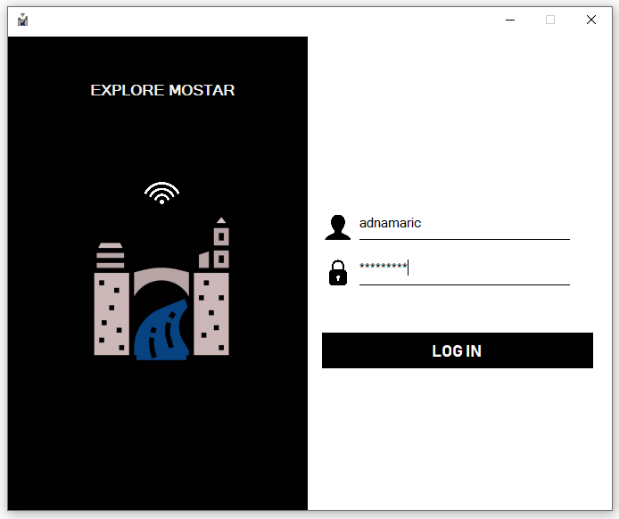
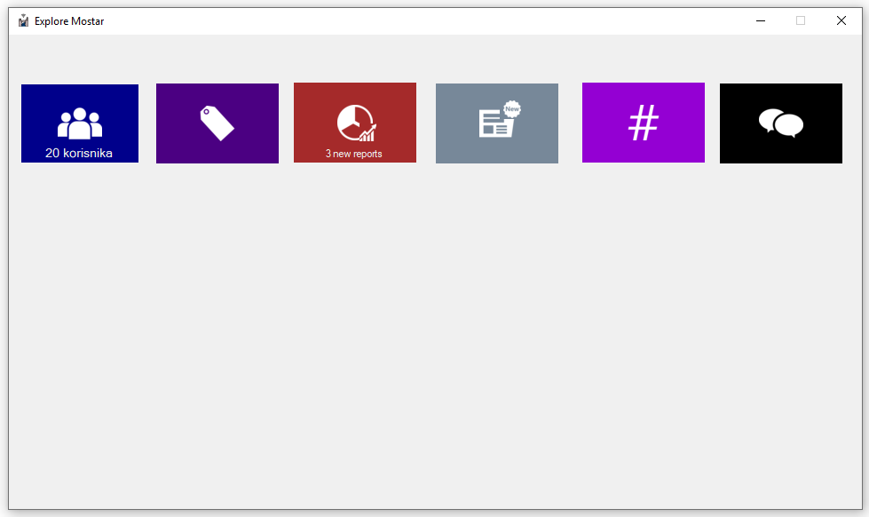
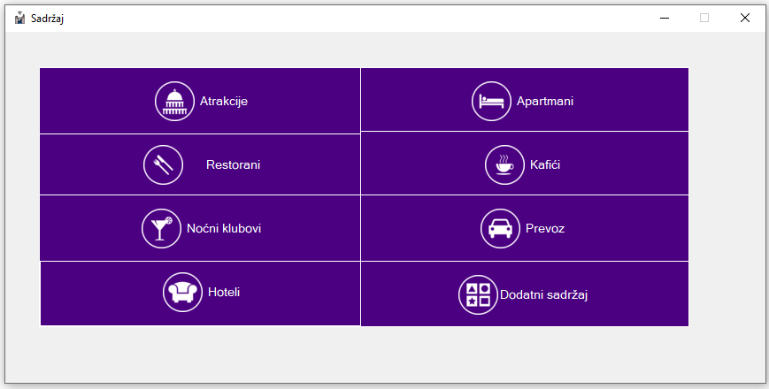
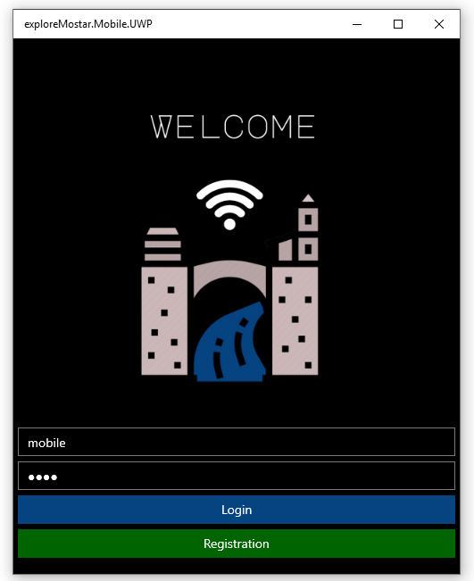
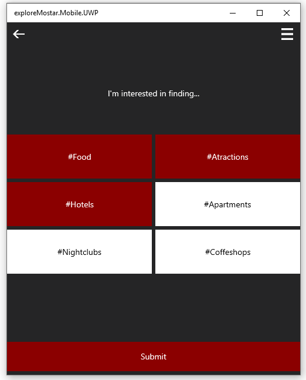
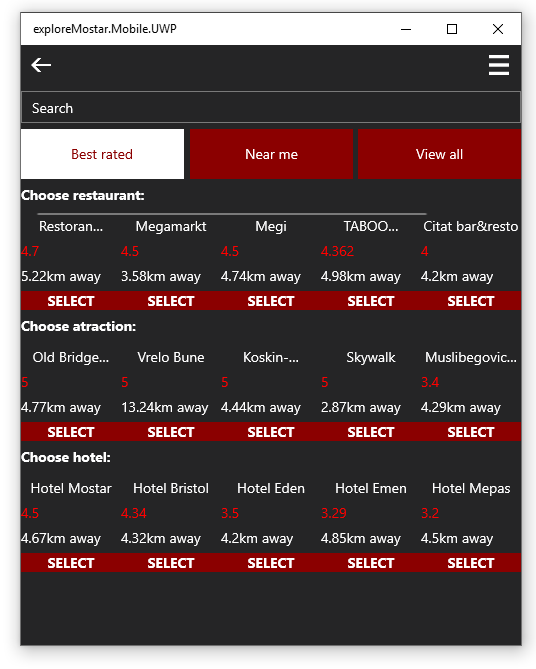
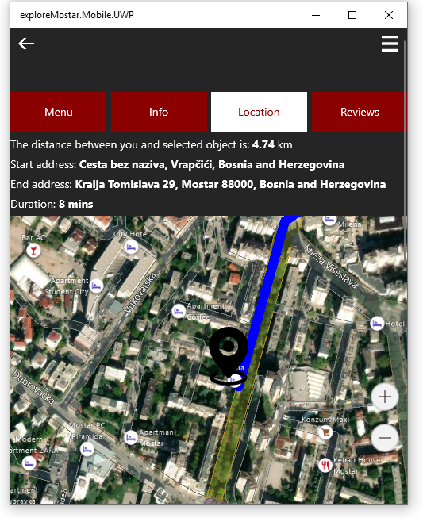

# ExploreMostar

Explore Mostar was my final-year thesis project, based on C# programming language and ASP.NET Core framework. The abovementioned project consists of two parts: a mobile application built on Xamarin platform and a Windows forms application. The mobile application takes the user's current location through external Google API and recommends the best content in the user's immediate vicinity ( ex: best restaurants, coffee shops). 

Preview of desktop application:    

 
 
 

 
   
 Preivew of mobile application:  
 

   

 
 
  
  
   
